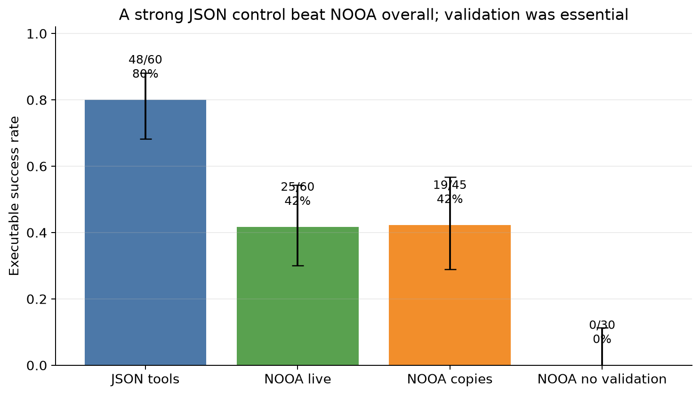
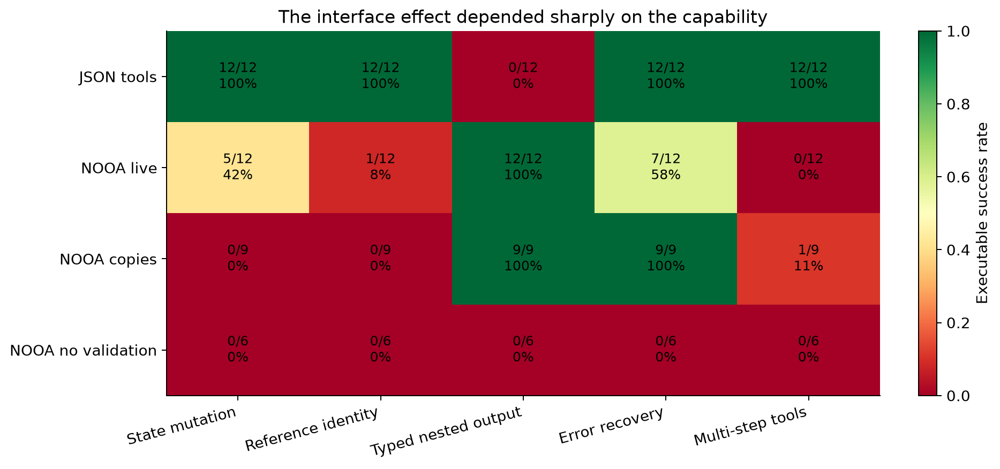
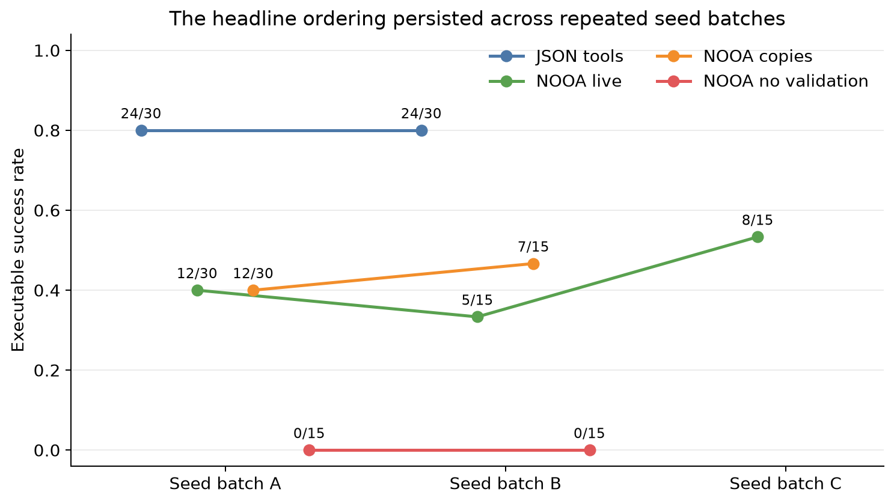
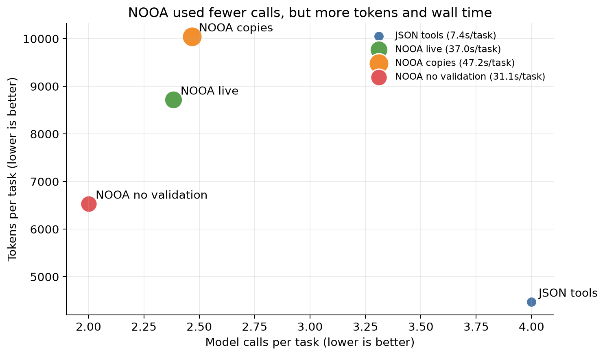
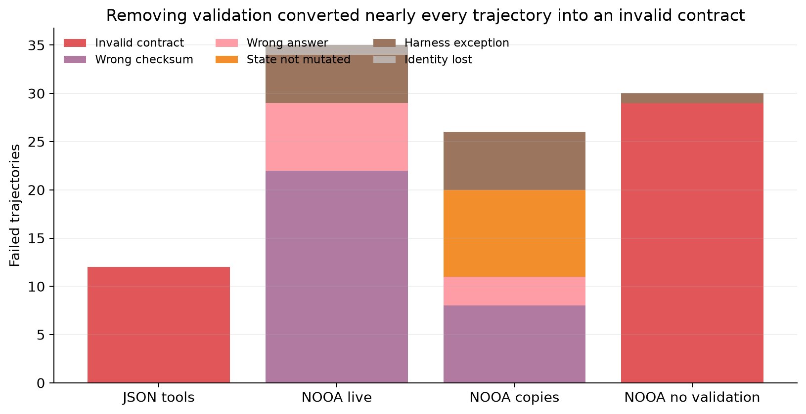

# Do live Python objects make agents more reliable?

Most agent systems describe tools by turning arguments and results into text-like records, while NOOA lets a model act on typed Python objects that remain alive in memory. The paper argues that this more direct interface makes stateful work easier and catches malformed answers before they escape. We tested that idea with one local model on small, executable tasks where object mutation, identity, output shape, recovery, and tool sequencing can be checked exactly.

**Verdict — partially reproduced.** Runtime return validation was decisive, and live references helped the targeted state-mutation task. The broader interface claim did not appear in this bounded setup: the transparent JSON-tool control reached **48/60 (80.0%)**, versus **25/60 (41.7%)** for live NOOA. This is a focused causal test, not a reproduction of the paper’s SWE-bench, Terminal-Bench, or ARC campaigns.



Each bar is the fraction of trajectories that passed an executable post-condition; whiskers are 95% Wilson intervals. More trials were run where independent replication was useful, so the exact counts are printed above the bars. The central result is the large JSON advantage, alongside the complete collapse after removing NOOA’s return validator.

## What was held fixed

We served `Qwen/Qwen3-30B-A3B-Instruct-2507` locally with vLLM and used temperature 0.2, top-p 0.9, six model turns, and 1,200 output tokens per turn. Every condition saw the same task intent and data, and every answer faced the same Pydantic contract and hidden executable checks. Five families tested: state mutation, shared-reference identity, nested typed output, recovery after a transient exception, and a dependent directory/payroll calculation.

The comparator was intentionally strong but minimal: ordinary JSON-schema function calls, server-side state, serialized observations, and final schema validation. NOOA used released CodeAct over live objects. Two ablations either changed the generation return annotation to `Any` or replaced the live workspace with snapshots and copy-returning helpers. The fixed command was:

```bash
uv sync --frozen --extra repro && uv run --extra repro python experiments/interface_reproduction/run.py
```

All evidence ran on OpenResearch Kubernetes using **NVIDIA RTX PRO 6000 Blackwell** GPUs, four per job and **16 GPUs peak concurrently**. The fresh recovery evidence window was 2026-07-27 00:55:19–02:04:28 UTC: **1.15 hours elapsed**, including setup and parallel runs.

## Where the effect came from



The average hides two opposing stories. NOOA was perfect on nested typed output (12/12), where the JSON loop was 0/12. But JSON was perfect on state, identity, recovery, and multi-step tasks, while live NOOA was only 5/12, 1/12, 7/12, and 0/12 respectively. Typed output therefore supports the paper’s contract mechanism, but this model often returned the wrong checksum after performing a useful action.

The live-reference ablation was narrower. Over nine matched seeds, live NOOA passed state mutation **3/9**, while copy semantics passed **0/9** and left the original object unchanged every time. Identity was 0/9 for both, so the identity claim is inconclusive here. Serialized copies were not worse overall (19/45, 42.2%) because they remained perfect on typed output and recovery.

| Claim | Paper evidence | Observed here | Assessment |
|---|---|---|---|
| Native object interface improves reliability | 97.9% across 4,400 focused instances; 84.7% stress aggregate | JSON 80.0% vs live NOOA 41.7% | Not aligned under this model and suite |
| Runtime type validation improves contracts/recovery | Typed returns are validated and retried | Validated 25/60; unvalidated 0/30, with 29 invalid contracts | Aligned |
| Pass-by-reference preserves state/identity | Live object arguments are a highlighted capability | State 3/9 live vs 0/9 copied; identity 0/9 both | Partially aligned |

The paper’s aggregate percentages and ours are not directly comparable: its evaluation spans ten models and broader capability instances, whereas this study deliberately isolates one model and five causal tasks.



Independent batches did not reverse the ordering. JSON reproduced at 24/30 twice; live NOOA ranged from 5/15 to 8/15; and both complete unvalidated batches were 0/15.

## Efficiency and diagnostics



Live NOOA used fewer model calls than JSON (2.38 vs 4.00 per task), but more tokens (8,720 vs 4,475) and trajectory wall time (37.0 vs 7.4 seconds). Code actions were often verbose and iterative, so fewer calls did not translate into lower cost or latency for this Qwen model.



Removing validation produced 29/30 invalid contracts and one harness exception. With validation present, the dominant live-NOOA diagnostic was a wrong checksum, not a parser failure. The copy ablation uniquely produced nine `state_not_mutated` outcomes, which is direct evidence that the mechanism changed the underlying state rather than merely the final text.

## Interpretation and limits

This experiment supports two mechanisms, not the headline generalization. Runtime type validation converted otherwise unusable model returns into valid structured objects, and live references enabled some genuine mutations. Yet a conventional loop that retained state behind JSON tools was much easier for this fixed model on four of five families. The result may reflect model-specific fluency with JSON calls, CodeAct prompt overhead, or our checksum-sensitive contracts.

The tasks are synthetic and small; the comparator is transparent but not one of the paper’s external agent baselines. No claim is made about full software-engineering or interactive-environment benchmarks. A fuller reproduction would add models of several sizes, published benchmark adapters, paired seed counts for every ablation, and prompt-equivalence audits.

Explore the frozen measurements in the [self-contained notebook](../../notebooks/nooa_interface_reproduction.py):

[](https://molab.marimo.io/github/alphaXiv/labs-oo-agents-532ce1e8/blob/main/notebooks/nooa_interface_reproduction.py)

Source: [NVIDIA OO Agents paper](https://arxiv.org/abs/2607.20709). Key code paths and lineage: [JSON control](https://github.com/alphaXiv/labs-oo-agents-532ce1e8/tree/orx/kubernetes-toolchain-json-control), [live NOOA](https://github.com/alphaXiv/labs-oo-agents-532ce1e8/tree/orx/toolchain-round-nooa-live), [serialized copies](https://github.com/alphaXiv/labs-oo-agents-532ce1e8/tree/orx/toolchain-round-nooa-serialized), and [validation ablation](https://github.com/alphaXiv/labs-oo-agents-532ce1e8/tree/orx/validation-ablation-shard-a).
