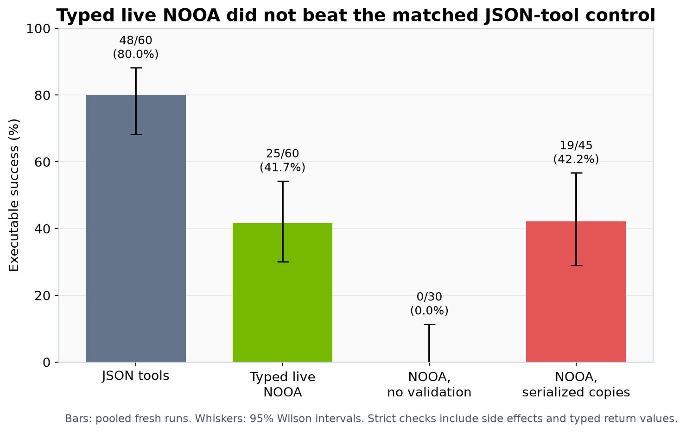
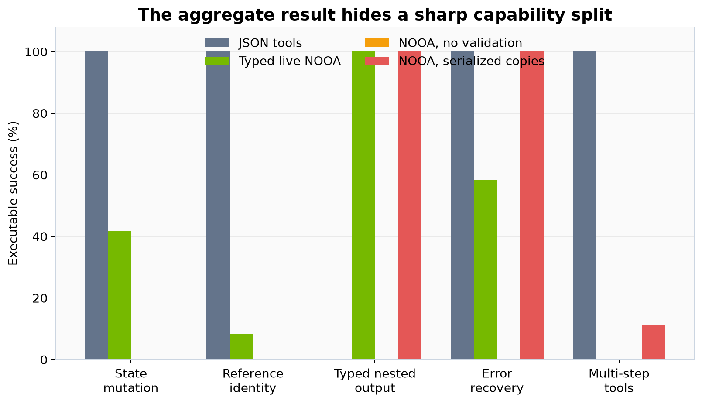
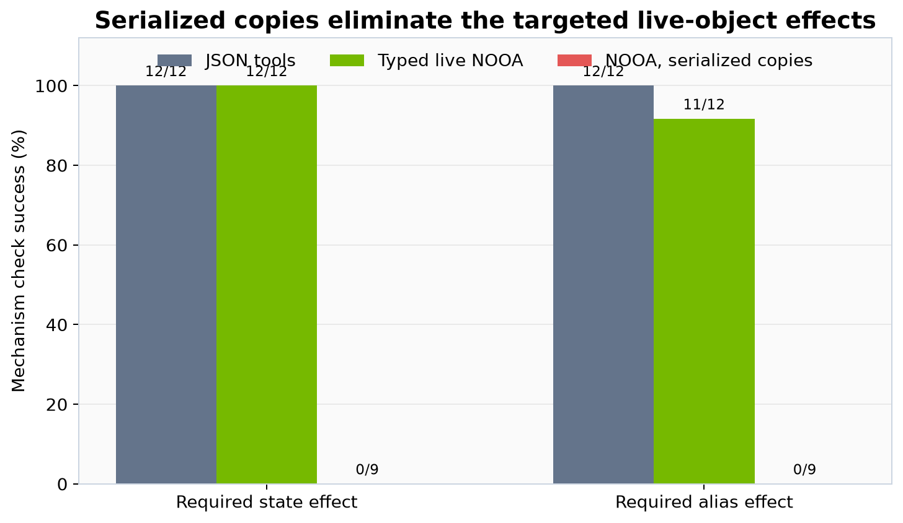
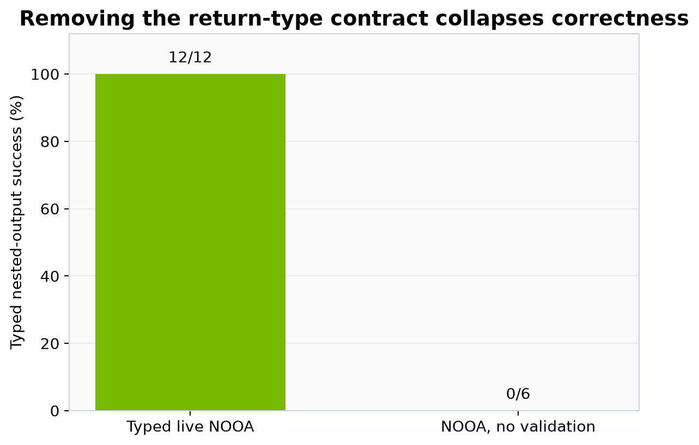
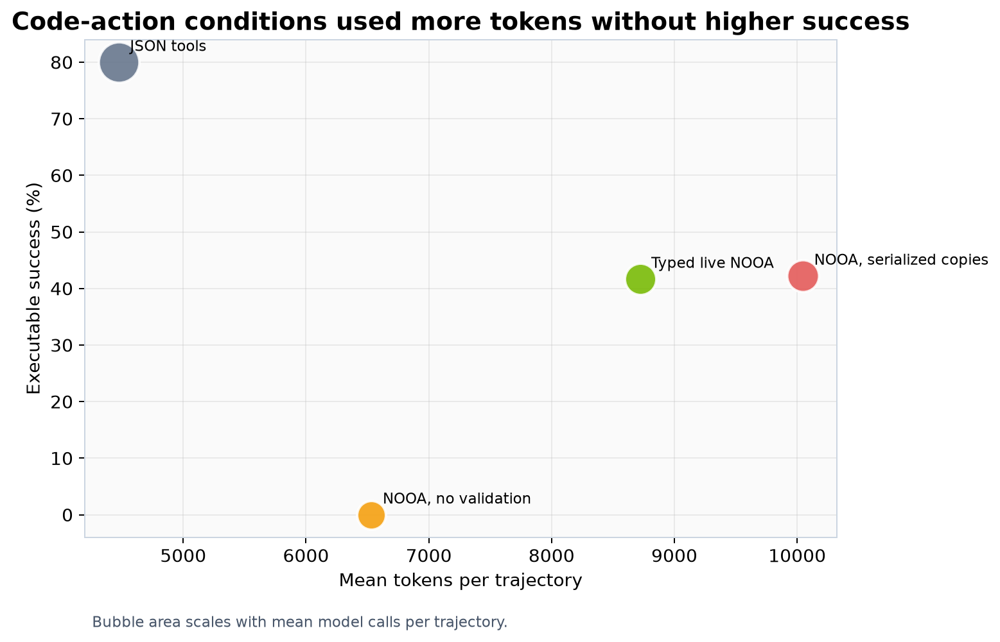

# Do live Python objects make agents more reliable?

AI agents usually act through serialized tool calls; NVIDIA’s OO Agents framework instead lets a model write code against typed, live Python objects. The paper argues that this more native interface makes complex agent programs easier to build and validate. We tested whether that interface itself improves reliability when the model, intent, tasks, sampling, and turn limits are held fixed.

## Verdict

**Partially reproduced.** Typed live NOOA did **not** improve strict end-to-end success over a minimal JSON-tool loop: it solved 25/60 tasks (41.7%) versus 48/60 (80.0%). The proposed mechanisms did matter, however: removing return-type validation reduced success to 0/30, while replacing live references with copies eliminated 18/18 targeted state and alias effects. This is a bounded causal suite, not a rerun of the paper’s full benchmarks.

Higher is better. Each trajectory passed only if its final typed value and executable workspace checks were both correct; whiskers are 95% Wilson intervals. The JSON result repeated exactly across two disjoint six-seed blocks. Live NOOA remained between 33% and 53% across three seed blocks.

## What was tested

We served `Qwen/Qwen3-30B-A3B-Instruct-2507` locally and paired four interfaces on five synthetic but executable capabilities: state mutation, alias identity, nested typed output, recovery from a transient error, and dependent multi-step tools. Temperature (0.2), top-p (0.9), six-turn limit, prompts, task data, and checks were fixed. Each formal condition used fresh runs created after the recovery cutoff.

The JSON control exposed ordinary schema tools and a validated `submit_result`. Typed NOOA exposed the same operations as methods on a live agent. One ablation changed only the generated method’s return annotation to `Any`; another supplied a JSON snapshot and copy-returning methods instead of live references. Generated code ran inside isolated Kubernetes jobs on synthetic data.

The paper reports 4,309/4,400 validation cases (97.9%) across its ten-model suite, including 254/300 (84.7%) on a stress subset. Those figures are context, not a directly comparable baseline: our 195-trajectory experiment asks a narrower causal question with one public local model.

## The interface helped one capability, not the suite

Typed NOOA repaired nested structured output in 12/12 trials, while JSON failed all 12 after exhausting its turn limit. The pattern reversed elsewhere: JSON was perfect on state, identity, recovery, and multi-step tasks. Live NOOA often performed the required mutation but returned an invented checksum, and it never completed the dependent employee-to-payroll chain. Thus the strict aggregate difference is not a generic failure to use tools; it is an interface-specific capability split.

In the first fully paired six-seed block, 18 task pairs favored JSON and six favored live NOOA; an exact two-sided McNemar test gives \(p=0.0227\). The additional disjoint blocks showed the same direction, but are reported descriptively because their seeds were not all paired.

## The mechanisms survived ablation

Strict final answers can obscure whether an object was actually changed. Looking only at the mechanism’s executable postcondition, live NOOA achieved the state effect in 12/12 trials and the alias effect in 11/12. Serialized copies achieved 0/9 on both because mutations never reached the original workspace. The JSON server-side tools also achieved 12/12, showing that live objects preserve identity but are not the only way to implement correct remote mutation.

The typed return contract was decisive for structured output: 12/12 with validation versus 0/6 without it. Across all no-validation tasks, 29/30 failures were contract-invalid and one was a generation exception, even though state side effects still occurred. This aligns with the claim that runtime validation improves return correctness and recovery.

## Efficiency and failure dynamics

JSON used 4,475 mean tokens and 7.4 seconds per trajectory, versus 8,720 tokens and 37.0 seconds for live NOOA. NOOA made fewer model calls (2.38 versus 4.00) but generated much longer code-action turns. Wrong checksums dominated live failures (22); copy failures additionally included nine expected `state_not_mutated` outcomes.

| Target claim | Observed evidence | Assessment |
|---|---|---|
| Typed live objects outperform serialized JSON tools | 25/60 vs 48/60 strict successes | Not aligned in this setup |
| Runtime validation matters | 12/12 vs 0/6 typed nested outputs; 0/30 overall without validation | Aligned |
| Pass-by-reference matters | 23/24 live mechanism effects vs 0/18 with copies | Aligned |
| Better efficiency | About 1.95× tokens and 5.0× latency for live NOOA | Not aligned |

## Limits and reproducibility

This suite deliberately isolates interface capabilities; it does not cover SWE-bench, Terminal-Bench, ARC-AGI-3, or the paper’s ten-model matrix. The JSON comparator is transparent but hand-built. Results may change with stronger models, different code-action prompting, or less artificial checksum fields. The copy ablation tests loss of live effects, not a production state-sync protocol.

Compute used the OpenResearch **Kubernetes** backend, **NVIDIA RTX PRO 6000 Blackwell** GPUs, a peak of **16 GPUs concurrently**, and **1.15 hours actual elapsed wall time** from fresh recovery orientation to the last scientific completion. Code, compact records, run IDs, and figure builder are in the [public repository](https://github.com/alphaXiv/labs-oo-agents-532ce1e8). Explore the self-contained notebook:

